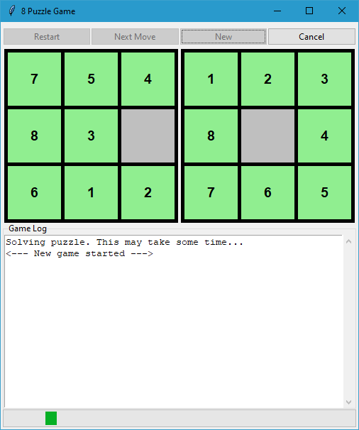
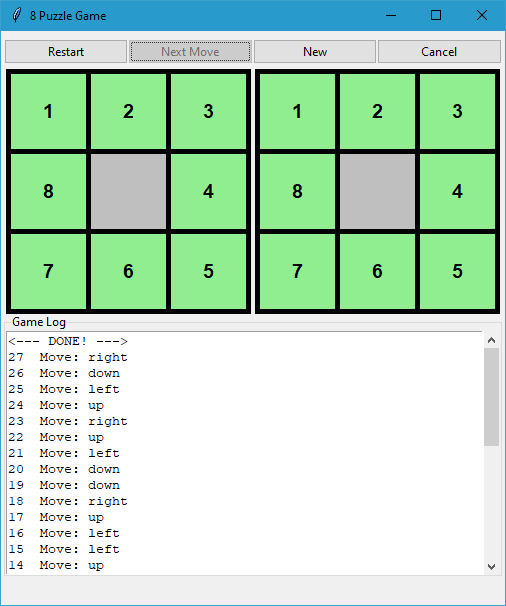

# N-Puzzle Solver

Welcome to my experimental N-Puzzle Solver repository! 
This project originated as a simple solver for a _concrete_ 3x3 puzzle configuration,
developed as part of a college assignment.
I then extended it into an N-Puzzle solver that (in theory) is capable of handling puzzles 
of arbitrary (`sqrt(N+1) x sqrt(N+1)`) sizes. 

Also included is a basic GUI, implemented using Tkinter, that visualizes the solving steps.

<table>
    <tr>
        <td>
            
            <p>GUI while calculating solution steps</p>
        </td>
        <td>
            
            <p>GUI after clicking 'next' button until puzzle is solved</p>
        </td>
    </tr>
</table>

## Table of Contents
- [Introduction](#introduction)
- [Features](#features)
- [Requirements](#requirements)
- [Usage](#usage)
  - [Clone the Repository](#clone-the-repository)
  - [Graphical User Interface](#graphical-user-interface)
- [Customization](#customization)
- [Known Issues](#known-issues)

## Introduction
The N-Puzzle is a classic sliding puzzle that consists of a grid of numbered tiles with one tile missing. 
The general objective is to rearrange the tiles by sliding them into the empty space until they represent the predefined goal state. 
This repository provides an implementation of an N-Puzzle solver that can handle puzzles of arbitrary sizes.

## Features
- **Solves N-Puzzles of any size**: The solver can handle puzzles larger than the standard 3x3.
- **Graphical User Interface (GUI)**: A basic GUI using Tkinter for visualizing the puzzle configurations and their solution.
- **Customizable**: Easily adaptable to different puzzle sizes and configurations.

## Requirements
- Python
    - developed using `3.12.3`
- Tkinter
    - should already come with your python install.

## Usage

### Clone the Repository
Clone the repository and switch to the project root folder:
```
git clone https://github.com/crochethk/n_puzzle_solver.git
cd n_puzzle_solver
```

### Graphical User Interface
To launch the Tkinter GUI run:

```bash
python -m gui.gui
```

The GUI allows you to interactively run through solutions to random puzzles:
- On the __left__ you can see the current board state.
- On the __right__ you can see the goal state.
- Use the "next" button to go through the solution step by step.
- Use the "reset" button to reset the current board.
- Use the "new" button to generate a new board and compute its solution (goal stays the same and is defined in `gui/gui.py`)
- *(Yet to be implemented)* Use the "cancel" button to abort computation of the solution.

## Customization
You can customize the solver for different puzzle configurations and sizes. 
Modify the `gui/gui.py` file to adjust the launch configuration as needed:
- `THE_INITIAL_BOARD` and `THE_GOAL_BOARD`:
    - Define the initial puzzle configuration
    - Their dimensions decide about the actual board size
    - Note that both must have the same dimensions (e.g. 3x3, 4x4, etc.).
- `THE_SEED`: determines the RNG used to generate new puzzle states. 

## Known Issues
- Cancel button not functional.

- Random puzzles greater than "3x3" might take a __very__ long time to solve. 
Reason beeing an unoptimized heuristic function for the implemented _A* Search_ together with
the the **large** increase in possible permutations, with growing board size. E.g. a `4x4` board has 
`16!/9!≈57.657.600` times more permutations a `3x3` board has.